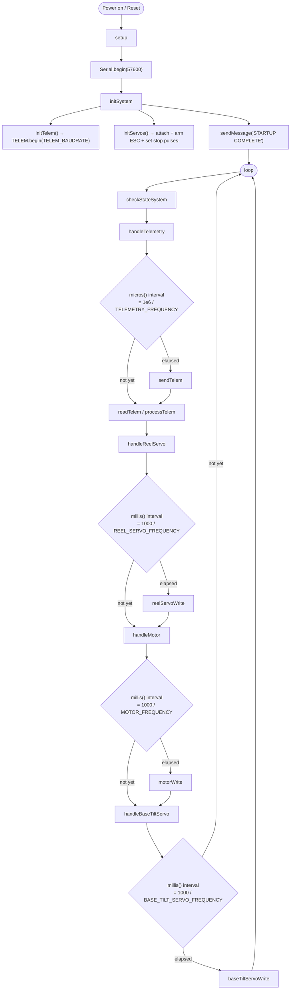
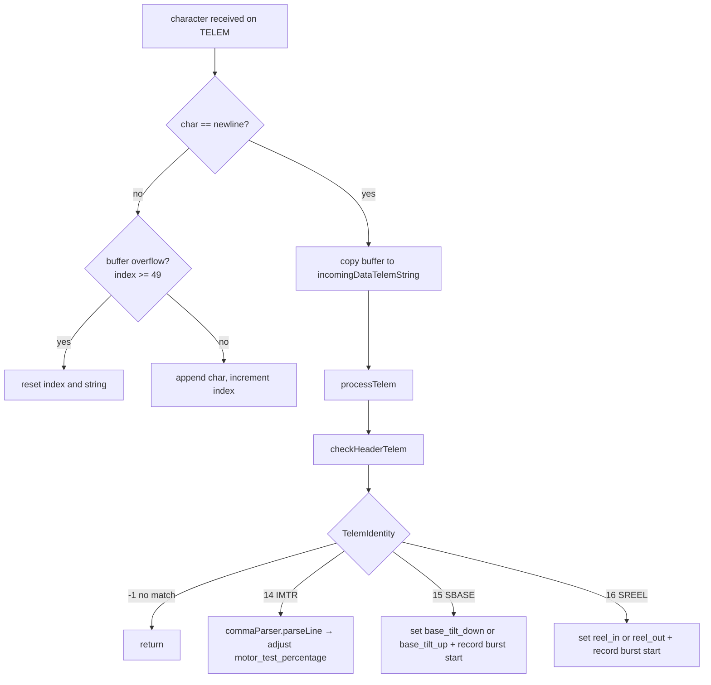
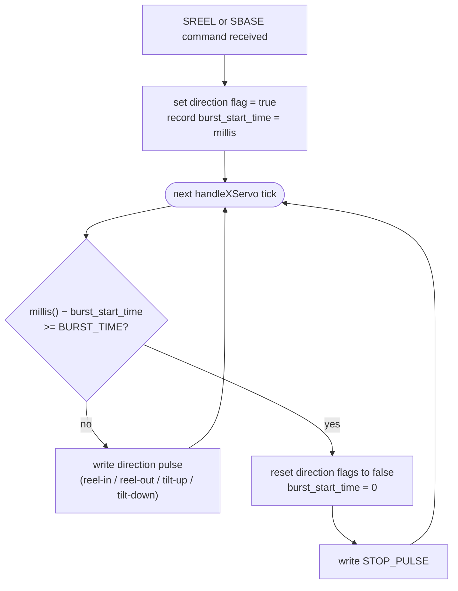
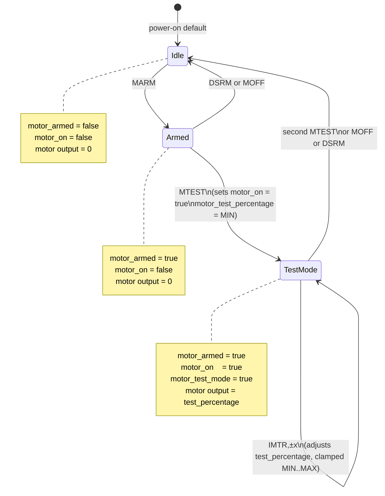

# MultiKite Firmware Internals

Reference for anyone modifying the Arduino sketch. Assumes familiarity with embedded C++, PWM, and serial protocols. Does not re-explain Arduino basics.

---

## Table of Contents

1. [File Structure](#1-file-structure)
2. [Execution Flow](#2-execution-flow)
3. [Serial Protocol](#3-serial-protocol)
   - [Outgoing telemetry](#31-outgoing-telemetry)
   - [Incoming commands](#32-incoming-commands)
4. [Actuator Subsystems](#4-actuator-subsystems)
   - [ESC / Motor](#41-esc--motor-pin-10)
   - [Reel Servo](#42-reel-servo-pin-11)
   - [Base Tilt Servo](#43-base-tilt-servo-pin-9)
   - [Burst timing logic](#44-burst-timing-logic)
5. [Motor State Machine](#5-motor-state-machine)
6. [Parameter Reference](#6-parameter-reference)
7. [How to Extend](#7-how-to-extend)
   - [Add a telemetry field](#71-add-a-telemetry-field)
   - [Add an incoming command](#72-add-an-incoming-command)
   - [Adjust timing and speed](#73-adjust-timing-and-speed)
8. [Known Issues and Discrepancies](#8-known-issues-and-discrepancies)

---

## 1. File Structure

Arduino compiles all `.ino` files in the sketch folder into a single translation unit, concatenated alphabetically by filename. The naming convention (`a_`, `b_`, ..., `z_`) enforces a deliberate include order.

| File | Compile order | Role |
|------|--------------|------|
| `mainCodeKite.ino` | 1 (main tab) | Comment header only; no code |
| `a_userParameters.ino` | 2 | All user-tunable `constexpr` values — **the only file end-users should edit** |
| `b_systemParameters.ino` | 3 | Hardware pin assignments, object declarations, runtime state variables, pulse ranges — do not modify unless changing hardware |
| `c_parametersCheck.ino` | 4 | `static_assert` guards that reject invalid parameter combinations at compile time |
| `e_setupConfiguration.ino` | 5 | `initSystem()`, `initServos()`, `initTelem()` called once from `setup()` |
| `g_auxComputing.ino` | 6 | State validation (`checkStateSystem()`), EWA filter, utility math |
| `h_motorsUtilities.ino` | 7 | Periodic handlers (`handleMotor()` etc.) and low-level PWM write functions |
| `i_telemetryUtilities.ino` | 8 | Serial read/write, frame parser, command dispatch (`processTelem()`) |
| `z_mainBody.ino` | 9 (last) | `setup()` and `loop()` entry points |

> `z_mainBody.ino` is last so all declarations in earlier files are visible. Do not move `setup()`/`loop()` to another file.

---

## 2. Execution Flow

`setup()` runs once; `loop()` runs continuously.



**Timing model**: all scheduling uses software polling (`millis()`/`micros()` deltas stored in `static` local variables). There are no hardware interrupts or RTOS tasks. The loop is cooperative; a blocking call in any handler will delay all others. Keep all handlers fast — no `delay()` after `setup()`.

---

## 3. Serial Protocol

A single hardware `Serial` port (USB) carries both outgoing telemetry and incoming commands, bidirectionally, at the same baud rate.

### 3.1 Outgoing Telemetry

**Direction**: Arduino → PC (Serial Studio)  
**Rate**: `TELEMETRY_FREQUENCY` Hz (default 10 Hz)  
**Framing**: newline before, `*` after each packet

```
\n$MKTE,f1,f2,f3,...,f27*
```

`sendTelem()` builds a `String fields[28]` array and serialises it. Fields not assigned default to an empty string, appearing as empty between consecutive commas.

**Active field map** (indices that currently carry data):

| Index | Variable | Type | Example value |
|-------|----------|------|---------------|
| 0 | Frame header | literal | `$MKTE` |
| 10 | `motor_output_percentage` | float | `23.5` |
| 11 | `motor_on` | string | `ON` / `OFF` |
| 12 | `motor_armed` | string | `ARMED` / `DISARMED` |
| 17 | Flight mode | string | `TEST MODE` / `STANDBY` |
| 25 | `errorMessage` | string | `NO ERRORS` |
| 26 | `returnMessage` | string | `MOTOR ARMED` |
| 27 | Fixed checksum stub | literal | `12` |

All other indices (1–9, 13–16, 18–24) are reserved for future sensors (IMU, GPS, SD card status) and are commented out in `i_telemetryUtilities.ino`.

**Example packet** (most fields empty):

```
\n$MKTE,,,,,,,,,,,23.50,ON,ARMED,,,,, STANDBY,,,,,,,,,,NO ERRORS,MOTOR ARMED,12*
```

**Adding more fields**: see [§7.1](#71-add-a-telemetry-field).

---

### 3.2 Incoming Commands

**Direction**: PC (Serial Studio) → Arduino  
**Framing**: newline-terminated (`\n` is the end-of-line delimiter in Serial Studio actions)

`readTelem()` reads one character at a time into a 50-byte circular buffer (`incomingDataTelem`). On receiving `\n`, it copies the buffer to `incomingDataTelemString` and calls `processTelem()`.

`processTelem()` calls `checkHeaderTelem()` first, which does substring matching (`indexOf`) against known command strings and sets a `TelemIdentity` integer used in the `switch` dispatch.



**Command table**:

| Keyword detected | `TelemIdentity` | Expected format | Action |
|------------------|----------------|-----------------|--------|
| `MARM` | (direct) | `MARM` | `motor_armed = true` |
| `DSRM` | (direct) | `DSRM` | `motor_armed = false` |
| `MOFF` | (direct) | `MOFF` | `motor_on = false` |
| `MTEST` | (direct) | `MTEST` | `toggleTest()` |
| `IMTR` | 14 | `IMTR,<float>` | `motor_test_percentage += inter`, clamped |
| `SBASE` | 15 | `SBASE,<-1\|1>` | Sets tilt direction flag + burst timer |
| `SREEL` | 16 | `SREEL,<-1\|1>` | Sets reel direction flag + burst timer |
| `TAO` | (direct) | `TAO` | Placeholder; sets `returnMessage` only |
| `LND` | (direct) | `LND` | Placeholder; sets `returnMessage` only |

**`checkHeaderTelem` evaluation order**: commands are checked via sequential `if` blocks, not `else if`. Multiple keywords in the same packet will all match. In practice Serial Studio sends one command per button press, so this is not a concern. Be aware when sending raw commands manually.

**`commaParser`** (TextParser library) is used only for the two-field commands (`IMTR`, `SBASE`, `SREEL`). It parses `COMMAND,VALUE` and returns the float value in `inter`.

---

## 4. Actuator Subsystems

All three actuators are controlled via the Arduino `Servo` library which outputs 50 Hz PWM with microsecond-precision pulse width. The ESC interprets this signal identically to a standard RC receiver.

### 4.1 ESC / Motor (Pin 10)

| Parameter | Value | Source |
|-----------|-------|--------|
| Pulse range | 850–1940 µs | Hobbywing datasheet |
| Update rate | 50 Hz (20 ms) | `MOTOR_FREQUENCY` |
| 0 % → pulse | 850 µs | `ESC_LOW_PULSE` |
| 100 % → pulse | 1940 µs | `ESC_HIGH_PULSE` |
| Max user-settable | 50 % → ~1395 µs | `MOTOR_MAX_PERCENTAGE` |
| Min user-settable | 8 % → ~941 µs | `MOTOR_MIN_PERCENTAGE` |

`motorWrite()` maps `motor_output_percentage` linearly onto the pulse range using `map()`. If `motor_on` or `motor_armed` is false, `motor_output_percentage` is forced to 0 and the ESC receives `ESC_LOW_PULSE` (idle/brake signal).

**ESC arming sequence**: `initServos()` writes `ESC_LOW_PULSE` and calls `delay(1000)` — this 1-second low pulse at startup is required by most ESCs to complete their arming handshake. Do not remove this delay.

---

### 4.2 Reel Servo (Pin 11)

The reel servo is a continuous rotation servo commanded by pulse width. The midpoint pulse (`REEL_STOP_PULSE = 1500 µs`) means stopped. Pulses above stop spin in one direction; pulses below spin in the other.

| Parameter | Value |
|-----------|-------|
| Pulse range | 1000–2000 µs |
| Stop pulse | 1500 µs (midpoint) |
| Update rate | 50 Hz |
| Reel-in speed | `REEL_STOP_PULSE × (1 − REEL_SPEED_DELTA_PERCENTAGE_REEL_IN)` |
| Reel-out speed | `REEL_STOP_PULSE × (1 + REEL_SPEED_DELTA_PERCENTAGE_REEL_OUT)` |
| Burst duration | `REEL_BURST_TIME_MILLIS` ms |

Speed is controlled by a fractional offset from the stop pulse. `REEL_SPEED_DELTA_PERCENTAGE_REEL_IN = 0.08` means reel-in pulse = `1500 × 0.92 = 1380 µs`.

---

### 4.3 Base Tilt Servo (Pin 9)

Identical architecture to the reel servo. The pulse range is asymmetric (1000–1940 µs), so the stop pulse is slightly off-centre:

```
BASE_TILT_STOP_PULSE = round((1000 + 1940) / 2.0) = 1470 µs
```

Speed offsets are applied relative to `BASE_TILT_STOP_PULSE`:

```
tilt-down pulse = STOP + DELTA_POSITIVE × (HIGH − STOP)
                = 1470 + 0.2 × (1940 − 1470)
                = 1470 + 94 = 1564 µs

tilt-up pulse   = STOP − DELTA_NEGATIVE × (STOP − LOW)
                = 1470 − 0.2 × (1470 − 1000)
                = 1470 − 94 = 1376 µs
```

The naming convention ("positive tilt" = `base_tilt_down`) follows the mechanical geometry of the specific platform; verify direction on your hardware before flying.

---

### 4.4 Burst Timing Logic

Reel and base tilt both use a burst model: a single command fires the servo for a fixed duration, then it returns to stop automatically. This prevents runaway actuation from dropped commands.



**Key consequence**: the "STOP TILTING" button (`SBASE,0`) sends a value of 0, which falls through the `processTelem()` switch without matching any case. The servo does **not** stop early — it always runs the full burst duration. If you need a genuine early-abort command, add an explicit `inter == 0` branch that clears the direction flags.

---

## 5. Motor State Machine

Three boolean variables drive motor behaviour: `motor_armed`, `motor_on`, `motor_test_mode`.



`checkStateSystem()` runs each loop iteration as a guard: if `motor_test_mode` is active but the motor becomes unarmed or turned off (e.g., via a concurrent `DSRM`), it cleans up `motor_test_mode` and resets the test percentage to `MOTOR_MIN_PERCENTAGE`.

Normal (non-test) flight with `motor_on = true` and `motor_test_mode = false` is structurally possible but has no current command to set it. `motor_output_percentage` would need to be driven externally (e.g., from a future autonomous controller).

---

## 6. Parameter Reference

All values in `a_userParameters.ino`. `c_parametersCheck.ino` enforces the bounds listed here at compile time.

| Constant | Default | Unit | Min | Max | Effect |
|----------|---------|------|-----|-----|--------|
| `TELEMETRY_FREQUENCY` | 10 | Hz | 1 | 100 | Outgoing packet rate. Scale baud rate proportionally if increased significantly. |
| `TELEM_BAUDRATE` | 57600 | bps | — | — | Must match Serial Studio. Whitelist: 9600, 14400, 19200, 28800, 38400, 57600, 115200, 230400, 250000, 460800, 921600. |
| `MOTOR_MAX_PERCENTAGE` | 50.0 | % | > MIN | 100 | Hard ceiling on thrust commands. |
| `MOTOR_MIN_PERCENTAGE` | 8.0 | % | 0 | < MAX | Lowest commandable thrust (below this the motor typically cannot spin from rest). |
| `REEL_SPEED_DELTA_PERCENTAGE_REEL_IN` | 0.08 | fraction | > 0 | ≤ 0.20 | Speed as fraction of stop-pulse range. Higher = faster reel-in. |
| `REEL_SPEED_DELTA_PERCENTAGE_REEL_OUT` | 0.06 | fraction | > 0 | ≤ 0.20 | Same for reel-out. |
| `REEL_BURST_TIME_MILLIS` | 300 | ms | > 0 | < 500 | Duration of one SREEL command. |
| `BASE_TILT_SPEED_DELTA_PERCENTAGE_POSITIVE_TILT` | 0.2 | fraction | > 0 | ≤ 0.30 | Fraction of half-range added to stop pulse for tilt-down. |
| `BASE_TILT_SPEED_DELTA_PERCENTAGE_NEGATIVE_TILT` | 0.2 | fraction | > 0 | ≤ 0.30 | Fraction subtracted for tilt-up. |
| `BASE_TILT_BURST_TIME_MILLIS` | 400 | ms | > 0 | < 500 | Duration of one SBASE command. |

**System constants** (in `b_systemParameters.ino`, change only with hardware changes):

| Constant | Value | Notes |
|----------|-------|-------|
| `BASE_PIN` | 9 | Must be a PWM pin |
| `ESC_PIN` | 10 | Must be a PWM pin |
| `REEL_PIN` | 11 | Must be a PWM pin |
| `ESC_LOW_PULSE` | 850 µs | Hobbywing minimum — verify against your ESC datasheet |
| `ESC_HIGH_PULSE` | 1940 µs | Hobbywing maximum |
| `BASE_TILT_LOW_PULSE` | 1000 µs | |
| `BASE_TILT_HIGH_PULSE` | 1940 µs | |
| `REEL_LOW_PULSE` | 1000 µs | |
| `REEL_HIGH_PULSE` | 2000 µs | |
| `bufferSize` | 50 | Max incoming packet length in bytes |

---

## 7. How to Extend

### 7.1 Add a telemetry field

1. **Pick an unused index** (0–27) in `sendTelem()`. Indices 1–9, 13–16, 18–24 are currently empty. Avoid index 0 (header) and 27 (checksum stub).

2. **Assign the value** in `sendTelem()`:
   ```cpp
   fields[18] = String(yourVariable, 2); // 2 decimal places
   ```

3. **Add the field in Serial Studio**:
   - Open `Base Station/Serial Studio LEONIDAS - Copy.json` in a text editor.
   - In the appropriate `"groups"` → `"datasets"` array, add a new entry:
   ```json
   {
       "index": 18,
       "title": "MY SENSOR",
       "units": "m/s",
       "widget": "",
       "graph": false
   }
   ```
   - Reload the project file in Serial Studio.

4. **Increase `NUM_FIELDS`** if you need more than 28 fields (unlikely without hardware expansion).

> **Index alignment**: the `index` value in the JSON maps directly to the position in the comma-split array, where index 0 is `$MKTE`. There is no offset.

---

### 7.2 Add an incoming command

1. **Choose a unique keyword** (no spaces, no commas). Check that it does not appear as a substring of an existing keyword — `checkHeaderTelem` uses `indexOf`, not exact match.

2. **Detect the keyword** in `checkHeaderTelem()`:
   ```cpp
   if (incomingDataTelemString.indexOf("MYCMD") != -1) {
       TelemIdentity = 20; // pick an unused case number
   }
   ```

3. **Handle the command** in `processTelem()`:
   ```cpp
   case 20:
       // for a simple flag command, no parsing needed:
       myFlag = true;
       returnMessage = "MY CMD RECEIVED";
       break;

   // or, for a parameterised command:
   case 20:
       commaParser.parseLine(incomingDataTelem, headerTelem, inter);
       myValue = constrain(inter, 0.0f, 100.0f);
       returnMessage = "MY VALUE: " + String(myValue);
       break;
   ```

4. **Add a Serial Studio action button** in the JSON `"actions"` array:
   ```json
   {
       "title": "My Command",
       "txData": "MYCMD,42",
       "eol": "\n",
       "icon": "Services"
   }
   ```

---

### 7.3 Adjust timing and speed

**Increase telemetry rate**: raise `TELEMETRY_FREQUENCY` in `a_userParameters.ino`. At 10 Hz with the current 28-field packet (roughly 150 characters), 57600 baud has headroom. At 50 Hz consider raising `TELEM_BAUDRATE` to 115200 and updating Serial Studio accordingly.

**Change servo update rate**: `REEL_SERVO_FREQUENCY`, `BASE_TILT_SERVO_FREQUENCY`, `MOTOR_FREQUENCY` are all in `b_systemParameters.ino`. Standard servos and ESCs expect 50 Hz; digital servos typically accept up to 330 Hz. Changing these values beyond what the hardware supports may cause erratic behaviour.

**Longer burst steps**: increase `REEL_BURST_TIME_MILLIS` or `BASE_TILT_BURST_TIME_MILLIS`. The `static_assert` clamps both to < 500 ms. To allow longer bursts, raise `REEL_BURST_TIME_MILLIS_CLAMPING` or `BASE_BURST_TIME_MILLIS_CLAMPING` in `b_systemParameters.ino` simultaneously.

---

## 8. Known Issues and Discrepancies

### 8.1 Serial Studio JSON vs firmware field indices

The JSON file in `Base Station/` was authored for an earlier field layout. Several mappings are incorrect with the current firmware:

| JSON label | JSON index | Current firmware field at that index | Correct index for this label |
|---|---|---|---|
| MOTOR THRUST (bar) | 11 | `motor_on` → `"ON"/"OFF"` string | Should be 10 (`motor_output_percentage`) |
| MODE | 18 | empty (unassigned) | Should be 17 (`TEST MODE`/`STANDBY`) |
| ERROR MESSAGE | 26 | `returnMessage` (the ACK) | Should be 25 (`errorMessage`) |
| ACK Message | 27 | fixed `"12"` | Should be 26 (`returnMessage`) |

**Impact**: the motor thrust bar will not animate; the MODE field will show nothing; error and ACK messages are swapped. Fix by editing the `index` values in the JSON or by re-assigning the `fields[]` slots in `sendTelem()`.

---

### 8.2 Double `Serial.begin()` on startup

`z_mainBody.ino` calls `Serial.begin(57600)` directly in `setup()`, then `initSystem()` calls `initTelem()` which calls `TELEM.begin(TELEM_BAUDRATE)`. Since `TELEM` is defined as `Serial`, the port is initialised twice. Arduino handles this gracefully (the second call re-initialises with the same rate), but the hardcoded `57600` in `z_mainBody.ino` will not pick up a changed `TELEM_BAUDRATE` from `a_userParameters.ino`. Remove the raw `Serial.begin(57600)` line from `z_mainBody.ino` to ensure only `initTelem()` controls the baud rate.

---

### 8.3 `SBASE,0` stop command is a no-op

The `processTelem()` case 15 handles values `-1` and `1` only. `SBASE,0` is ignored; the "STOP TILTING" button in Serial Studio has no effect. The servo stops naturally when the burst timer expires. To implement a genuine abort, add `else if (inter == 0) { base_tilt_down = false; base_tilt_up = false; }` in case 15.

---

### 8.4 Reel speed formula inconsistency

The reel-in and reel-out pulses are calculated differently from the base tilt servo:

```cpp
// Reel: multiplicative offset from STOP
reel_in:  REEL_STOP_PULSE * (1 - DELTA_IN)
reel_out: REEL_STOP_PULSE * (1 + DELTA_OUT)

// Base tilt: additive offset scaled to half-range
tilt-down: STOP + DELTA × (HIGH - STOP)
tilt-up:   STOP - DELTA × (STOP - LOW)
```

The reel formula makes the speed delta asymmetric because `REEL_STOP_PULSE` differs from the midpoint of the range only when the range is not centred on 1500 µs (currently it is: `(1000+2000)/2 = 1500`). For the reel servo this produces equivalent results. For a servo with an asymmetric range, use the base-tilt formula instead.
